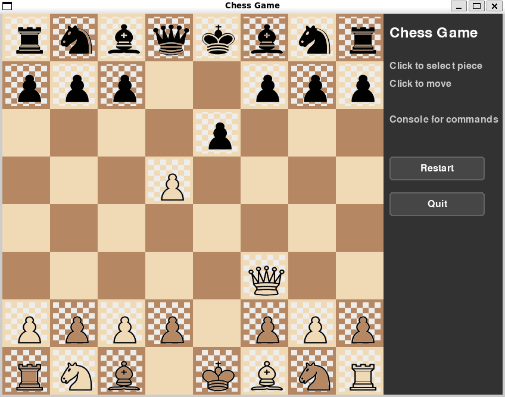
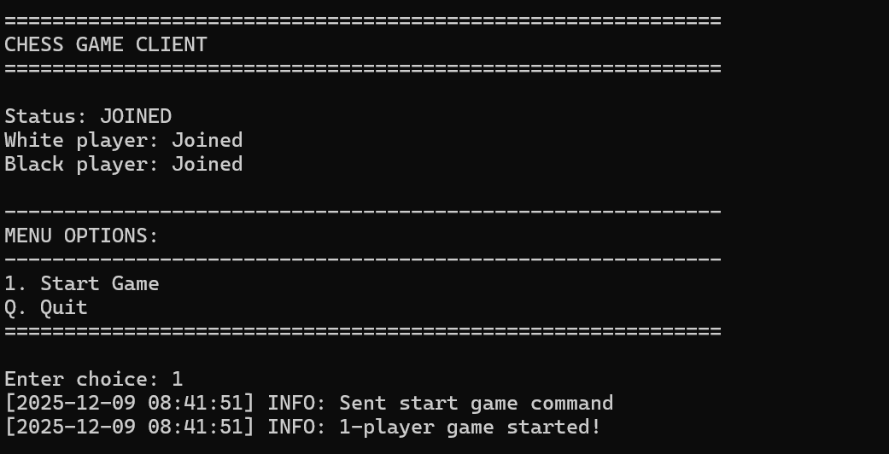
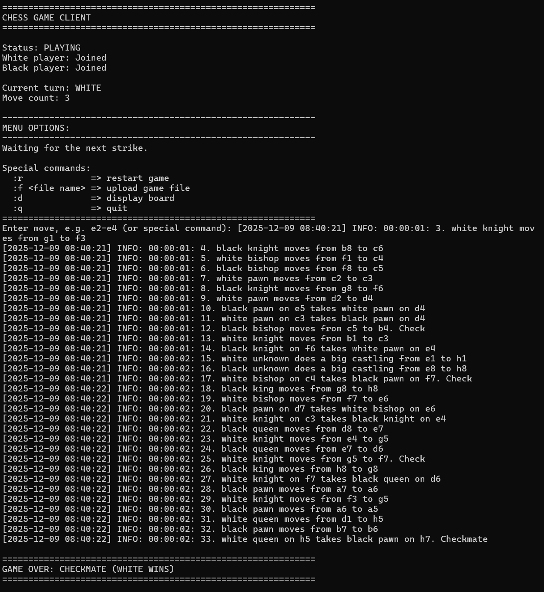

# ♟️ Chess Server & Client

[](https://isocpp.org/)
[](https://www.python.org/)
[](https://cmake.org/)
[]()

**A multi-player networked chess application with client-server architecture, multiple transport protocols, and dual notation system support.**

[Features](#-features) • [Architecture](#-architecture) • [Build](#-build-instructions) • [Usage](#-usage) • [Screenshots](#-screenshots) • [Documentation](#-documentation)

---

## 📸 Screenshots

### GUI Mode

*Graphical interface with board display*

### Multi-Player Game

*Two clients connected in a live game*

### Game File Playback

*Loading and replaying PGN game files*

---

## 🎯 Features

### Core Functionality
- 🌐 **Multi-Protocol Transport**: TCP and Unix Domain Sockets (IPC) support
- 📝 **Dual Notation Systems**: 
  - Simple Notation: `e2-e4`, `Ng1-f3`
  - PGN/SAN Notation: `e4`, `Nf3`, `O-O`, `Qxd7+`
- 🎮 **Multi-Player Support**: Real-time networked two-player games
- 📁 **File Playback**: Load and replay PGN game files
- 🔄 **Live Game State**: Real-time board synchronization between clients

### Technical Highlights
- 🔍 **ANTLR-Based Parsing**: Grammar-driven move validation with AST traversal
- 🧵 **Modern C++ Concurrency**: `std::jthread` with cooperative cancellation
- 🎨 **Interactive GUI**: pygame-based graphical interface
- 📊 **Comprehensive Logging**: Multi-level logging with spdlog (C++) and Python Logger
- 🧪 **Full Test Coverage**: GoogleTest (C++) and pytest (Python)
- 📚 **Professional Documentation**: Doxygen (backend) and Sphinx (frontend)

---

## 🏗️ Architecture

### System Overview

```
┌─────────────────────────────────────────────────────────────┐
│                      Chess Application                       │
├─────────────────────────┬───────────────────────────────────┤
│   Frontend (Python)     │      Backend (C++)                │
│                         │                                    │
│  ┌──────────────┐       │       ┌──────────────┐            │
│  │     View     │       │       │    Server    │            │
│  │   (pygame)   │       │       │  (jthread)   │            │
│  └──────┬───────┘       │       └──────┬───────┘            │
│         │               │              │                     │
│  ┌──────▼───────┐       │       ┌──────▼───────┐            │
│  │ Controller   │◄──────┼───────┤   Session    │            │
│  │ (GameCtrl)   │       │       │  Management  │            │
│  └──────┬───────┘       │       └──────┬───────┘            │
│         │               │              │                     │
│  ┌──────▼───────┐       │       ┌──────▼───────┐            │
│  │    Model     │       │       │  ChessGame   │            │
│  │ (GameModel)  │       │       │(chess-library)            │
│  └──────┬───────┘       │       └──────┬───────┘            │
│         │               │              │                     │
│  ┌──────▼───────┐       │       ┌──────▼───────┐            │
│  │  Transport   │◄──────┼───────►   Transport  │            │
│  │  (Strategy)  │  TCP/ │ IPC   │   (OSI L4)   │            │
│  └──────────────┘       │       └──────────────┘            │
│                         │              │                     │
│                         │       ┌──────▼───────┐            │
│                         │       │    Parser    │            │
│                         │       │   (ANTLR)    │            │
│                         │       └──────────────┘            │
└─────────────────────────┴───────────────────────────────────┘
```

### Technology Stack

#### Backend (C++)
| Component | Technology | Purpose |
|-----------|-----------|---------|
| **Language** | C++20 | Modern features, jthread, concepts |
| **Build System** | CMake 3.16+ | Cross-platform build automation |
| **Package Manager** | vcpkg | Dependency management |
| **Parser** | ANTLR 4.13.1 | Grammar-based move parsing |
| **Chess Engine** | chess-library | Move validation, game state |
| **Logging** | spdlog | High-performance logging |
| **Testing** | GoogleTest | Unit and integration tests |
| **Documentation** | Doxygen | API documentation |

#### Frontend (Python)
| Component | Technology | Purpose |
|-----------|-----------|---------|
| **Language** | Python 3.11+ | Rapid development, type hints |
| **GUI** | pygame | Interactive chess board |
| **Testing** | pytest | Test framework |
| **Documentation** | Sphinx | User and API docs |
| **Virtual Env** | uv | Fast environment management |

### Design Patterns

| Pattern | Location | Purpose |
|---------|----------|---------|
| **MVC** | Frontend architecture | Separation of concerns |
| **State** | `GameContext`, `GameState` | Game state transitions |
| **Factory** | `ParserFactory`, `TransportFactory` | Object creation abstraction |
| **Strategy** | `ITransport` → `TCPTransport`/`IPCTransport` | Transport selection |
| **Visitor** | ANTLR AST traversal | Parse tree processing |
| **Singleton** | `Logger` | Centralized logging |

---

## 🔧 Build Instructions

### Prerequisites

#### Backend
- C++20 compatible compiler (GCC 10+, Clang 12+, MSVC 2019+)
- CMake 3.16+
- vcpkg package manager
- ANTLR 4.13.1 runtime

#### Frontend
- Python 3.11+
- uv (or pip/venv)
- pygame

### Backend Build

```bash
cd /path/to/project/root/src/backend

# Configure with vcpkg toolchain
cmake -B build/debug -S . \
  -DCMAKE_BUILD_TYPE=Debug \
  -DCMAKE_TOOLCHAIN_FILE=/path/to/vcpkg/scripts/buildsystems/vcpkg.cmake

# Build (parallel)
cmake --build build/debug --parallel $(nproc)

# Run tests
ctest --test-dir build/debug --output-on-failure
```

#### Server Options

```bash
# TCP mode, PGN notation (default)
./build/debug/exe/chess_server

# Verbose logging
./build/debug/exe/chess_server -v

# IPC (Unix socket) mode, Simple notation
./build/debug/exe/chess_server -l -s

# Help
./build/debug/exe/chess_server -h
```

### Frontend Setup

```bash
cd /path/to/project/root

# Create and activate virtual environment
env=.venv
uv venv $env --python python3.11
source "$env/bin/activate"

# Verify Python version
python --version && which python

# Install dependencies (if not already in requirements.txt)
pip install pygame pytest
```

---

## 🚀 Usage

### Running the Client

#### Text Mode (CLI)
```bash
PYTHONPATH=src/frontend python -m chess_client
```

#### GUI Mode (Single Player)
```bash
PYTHONPATH=src/frontend python -m chess_client --gui
```

#### Load Game File
```bash
PYTHONPATH=src/frontend python -m chess_client -f test/game/game_01
```

#### IPC (Unix Socket) Mode
```bash
PYTHONPATH=src/frontend python -m chess_client --local
```
> **⚠️ Note**: Server must also be running in IPC mode (`-l` flag)

### Multi-Player Workflow

1. **Start the server**:
   ```bash
   ./build/debug/exe/chess_server
   ```

2. **First client** - Join as White:
   ```bash
   PYTHONPATH=src/frontend python -m chess_client
   # Select "Join as White Player"
   ```

3. **Second client** - Join as Black:
   ```bash
   PYTHONPATH=src/frontend python -m chess_client
   # Select "Join as Black Player"
   ```

4. **Either player** can press "Start Game" to begin.

### In-Game Commands

Once the game has started, use these commands in text mode:

| Command | Description |
|---------|-------------|
| `e2-e4` or `e4` | Make a move (depends on server notation mode) |
| `:r` | Restart the game |
| `:f <filename>` | Upload and replay a game file |
| `:d` | Display pretty-printed ASCII board |
| `:q` | Quit the game |

### Notation Modes

#### Simple Notation
```
e2-e4
Ng1-f3
Bf1-c4
```

#### PGN/SAN Notation
```
e4
Nf3
Bc4
O-O
Qxd7+
```

> **📌 Tip**: The client automatically adapts to the server's notation mode. No configuration needed!

---

## 📚 Documentation

### Generate Backend Documentation (Doxygen)

```bash
cd /path/to/project/root/build/backend/debug

# Build docs
cmake --build . --target doc_doxygen

# Open in browser
xdg-open doc/html/index.html
```

### Generate Frontend Documentation (Sphinx)

```bash
cd /path/to/project/root/doc/frontend

# Activate virtual environment first
rm -rf html
sphinx-build -b html . html

# Open in browser
xdg-open html/index.html
```

---

## 🧪 Testing

### Backend Tests (GoogleTest)

```bash
cd /path/to/project/root/src/backend
ctest --test-dir build/debug --output-on-failure -V
```

### Frontend Tests (pytest)

```bash
cd /path/to/project/root
PYTHONPATH=src/frontend pytest src/frontend/test/network/test_tcp_transport.py -v
```

---

## 📁 Project Structure

```
network-chess-game/
├── src/
│   ├── backend/          # C++ server implementation
│   │   ├── exe/          # Server executable
│   │   ├── parser/       # ANTLR grammars and generated code
│   │   └── test/         # GoogleTest unit tests
│   └── frontend/         # Python client implementation
│       ├── controllers/  # MVC controllers
│       ├── models/       # Game state models
│       ├── network/      # Transport layer
│       ├── views/        # GUI and text views
│       └── test/         # pytest tests
├── doc/
│   ├── backend/          # Doxygen output
│   └── frontend/         # Sphinx documentation
├── test/
│   └── game/             # Sample game files (PGN)
├── conf/
│   └── config.json       # Server configuration
└── screenshots/          # Application screenshots
```

---

## 🤝 Contributing

See [AUTHORS.md](AUTHORS.md) for contributor information.

---

## 📄 License

This project is licensed under the MIT License.

---

## 🔗 Resources

- [Chess Programming Wiki](https://www.chessprogramming.org/)
- [PGN Specification](https://www.chessclub.com/help/PGN-spec)
- [ANTLR Documentation](https://www.antlr.org/)
- [chess-library](https://github.com/Disservin/chess-library)

---

<div align="center">

**Built with ♟️ by Mathieu Delehaye, 2025**


</div>


